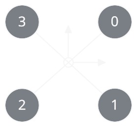
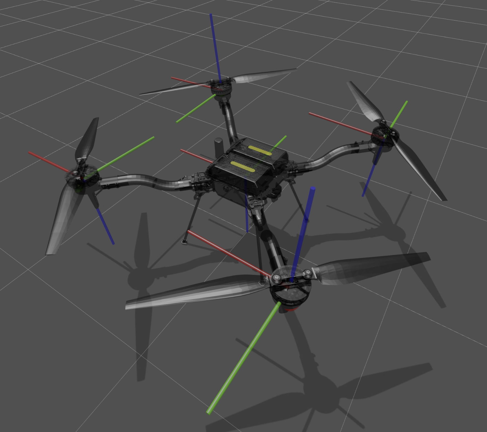
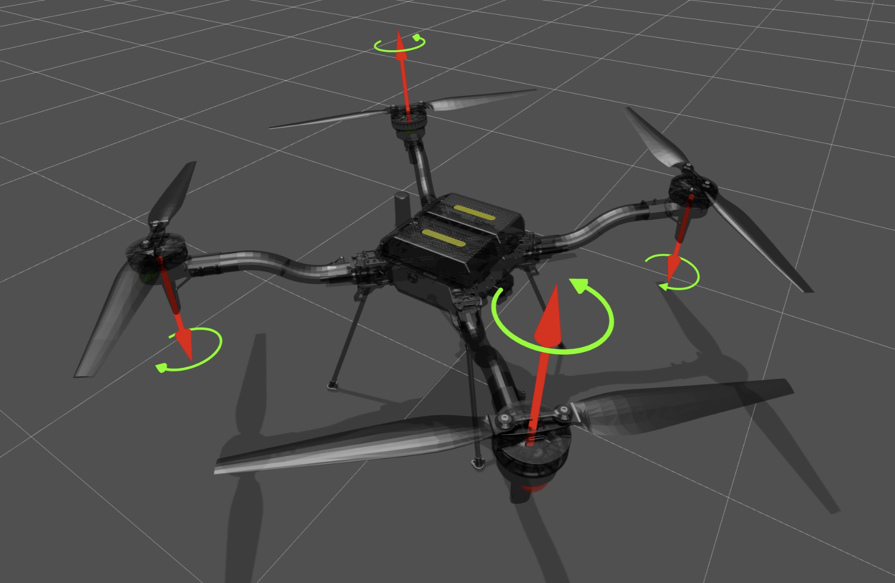

# Conventions

Two rules for the component seams, then the structure of every shipped vehicle.

## Where a seam lives

A seam lives at or below its consumer: in the caller's own package, or lower in the import layers
`.importlinter` fixes. The orchestrator drives `Clock`, `Physics`, `Actuator`, `Sensor`,
`Controller`, `Renderer` and `Recorder` and sits at the bottom layer, so those contracts live in
`core/`. `SceneHandler`'s consumers are the render frame and the stage compose, both higher in the layers
than `scene/`, so it lives beside its implementations in `scene/base.py`. A contract that sits higher
than its consumer ends up written twice: once where the consumer can import it, once beside the
implementations. That's how the actuator seam came to exist in two files before this rule.

## Which seams are customizable

Three tiers. A vehicle or a scene **declares** a component in its Universal Scene Description (USD)
when the component is a property of the machine or of the site. `Controller`, `Actuator`, `Sensor`
and `Companion` are the vehicle's. What a scene contributes is the scene's. The `Operator` and the
`Renderer` of the runtime are properties of the run, not of either, so they stay **arguments**. `Clock`, `Physics`, `Recorder` and `Logger` are the
framework's own architecture, **fixed**: one implementation each, configured by settings rather than
swapped, so none gets a resolver or a published Protocol. Fixed is about publishing no resolver, not
about which directory the implementation sits in: `_src/physics/` imports `newton` and
`_src/rendering/` imports Kit, which `.importlinter` keeps out of `core/`.

## The vehicle model

The loop names no vehicle type: `Controls` carries one command per actuator, and the base body is
whatever body the actuator joints share. Only the shipped actuator, the example controllers, and the
vehicle USDs are **quad-X**. Every shipped vehicle is a USD authored to the structure and frames
below, because the framework **only ever builds models from
USDs** and never synthesizes one in code. Supporting a different quad is a new USD authored this way
plus a retune of the cost weights and the motor map, with no code changes. In particular you
**must** author the base body as Forward Right Down (FRD), as `body_frd` with body +z down, with
four rotor **revolute** joints, because:

- the shipped actuator, the example controllers and the PX4 path all assume thrust along
  **−body-z**, the FRD convention. It's a hardcoded invariant, not a per-call parameter.
- the differentiable examples, sampling Model Predictive Control (MPC) and design-opt, build their single rigid body by
  **fixing the rotor revolute joints and collapsing them** with `ModelBuilder.collapse_fixed_joints`.
  So the rotors must be revolute joints off the base, or the collapse can't find and merge them.

## Rotor indexing

## Model structure

- **World**
    - **Body**, `body_frd`: a link on a free joint, a floating base, with FRD axes
        - **Rotor 1**, `rotor_1`: a link on a revolute joint, positive rotation along the $z$ axis
        - **Rotor 2** and **Rotor 3**: the same
        - **Rotor 4**, `rotor_4`: a link on a revolute joint, positive rotation along the $z$ axis

## Frames

| Frame     | Symbol          | Origin                    | Axes                                   |
| --------- | --------------- | ------------------------- | -------------------------------------- |
| Body      | $\mathcal{B}$   | Vehicle center of gravity |  $x$ forward, $y$ right, $z$ down      |
| Rotor $i$ | $\mathcal{R}_i$ | Rotor center of gravity   | $x$ forward, $z$ according to rotation |

