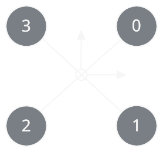
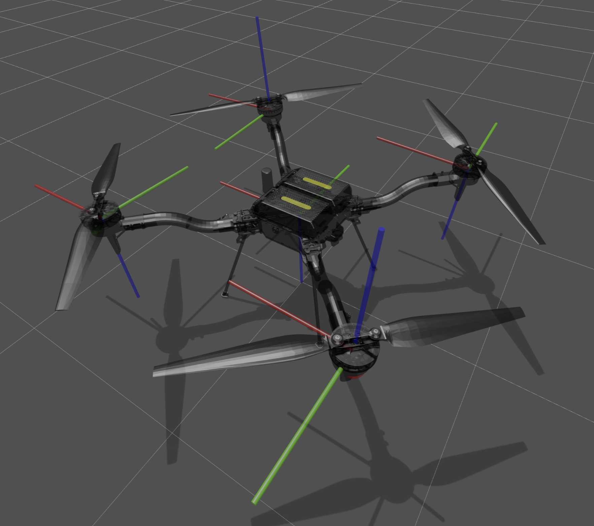
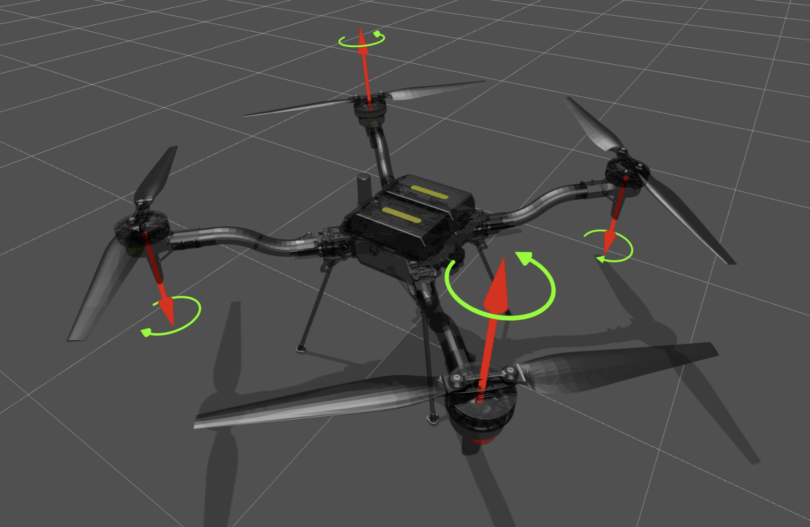

# Conventions

The rules for the components' contracts and for the project's names, then the structure of every
shipped vehicle. [Concepts](concepts.md) defines each term.

## Where a contract lives

A contract lives at or below its consumer: in the caller's own package, or lower in the import layers
`.importlinter` fixes. The [loop](concepts.md#loop) drives `Clock`, `Physics`, `Sensor`, `Controller`,
`Renderer` and `Recorder`, and the stages a command element or a force element states, and sits at
the bottom layer, so those contracts live in `core/`. A contract that sits higher
than its consumer ends up written twice: once where the consumer can import it, once beside the
implementations. That's how the actuator's contract came to exist in two files before this rule.

## Who declares a part

A vehicle **declares** a component in its Universal Scene Description (USD) when the component is a
property of the machine: every [role](concepts.md#role) but the guidance. What a scene contributes
is the scene's. The guidance is a property of the run, not of either, so it stays
an **argument**: a flight constructs it and hands it to `Sim`. It holds no controller: the loop
hands the setpoint it writes to the tick to the controller. PX4 takes none, because its own
navigator is its guidance. The `Renderer` follows from the vehicle: a sensor whose class requires
the Kit render peer starts it. The clock, the [physics](concepts.md#physics), the
[Recorder](concepts.md#recorder), and the [Logger](concepts.md#logger) stay **fixed**: one
implementation each, configured by settings rather than swapped, so none gets a resolver or a
published Protocol. Fixed is about publishing no resolver, not
about which directory the implementation sits in: `_src/physics/` imports `newton`, which
`.importlinter` keeps out of `core/`, and no module imports Kit, which runs only in the Kit peer.

## How a peer enters a run

A [peer](concepts.md#peer) enters a run in one of two ways, and one question separates them: does
the peer have a counterpart on the real vehicle?

- A **declared peer** stands in for a part of the vehicle, so the vehicle's USD declares it with a
  schema. PX4 Software In The Loop (SITL) stands in for the flight controller, and
  `NexusPx4SitlAPI` on the vehicle's root prim declares it. The run starts it, and a run's override
  layer drops the declaration to attach to a process started elsewhere.
- A **required peer** is part of the model that replaces a real component, so the component's class
  requires it, and no asset names it. The real camera is the component, and the Kit render peer is how
  its model computes an image. A camera's schema says what the camera is: its resolution and its
  rate. The class the registry maps that schema to states `requires = ("kit",)`, and the build
  starts the peer once for all the sensors that require it.

The split is a design choice. A Kit schema on the vehicle would put a renderer into the description
of a vehicle, and a second renderer would then need a layer on every run to drop it. With a required
peer, another renderer is another class for the same camera schema, one registry entry.

## Who owns an address

The run owns every address. A [link](concepts.md#link) runs over a socket between two processes, and
one side has to pick the port. The run picks, because only the run knows what else flies on the machine. It claims the
lowest PX4 instance free there and numbers every link from it, so two runs on one machine never
collide.

Where an address goes depends on which side of the run the link's end sits:

- **An end inside the run**: the builder builds it from the run's addresses. The PX4 controller's
  Hardware In The Loop (HIL) server is one, and the builder hands the controller its port.
- **An end outside the run**: it reads its address from the run's [port map](concepts.md#port-map),
  `sim.ports`. PX4's
  offboard link is one. A script opens its own client, `nexus_sim.px4.OffboardClient`, on
  `sim.ports["offboard"]`, which holds the port and PX4's MAVLink system id.

The split is a design choice, and it follows from a second rule: no generic part names PX4. The
loop, the roles' contracts and `Sim` carry no PX4 class, port or verb, and an import contract in
`.importlinter` holds that. A client that `Sim` built for the script would put a PX4 class into
`Sim`. A method on the peer object would ask the peer for a port the run owns. It would also miss a
run attached to a PX4 started elsewhere, which holds no peer object while the link is live. So the
script that commands PX4 names it, and the port map serves every link that leaves the run alike.

A link with nothing behind it stays out of the map. A run against the fake PX4 lists no offboard
link, so the lookup fails at once and names the fake, and no client waits on a link nothing answers.

## Names

The project's name takes three forms, each for one kind of thing:

| Form | What takes it | Example |
|---|---|---|
| `nexus-sim` | The distribution on PyPI | `pip install nexus-sim` |
| `nexus_sim` | The Python import package and its folder: every name Python resolves | `import nexus_sim as nx`, `nexus_sim/_src/` |
| `nexus` | The project, and every name outside Python's import system | the `nexus` command, the `nexus:` USD attributes, the `nexus.components` entry-point group, the `nexus` logger, the `nexus.peer` Docker label, `nexus.catalog.yaml`, `~/.cache/nexus` |

The reinforcement learning project follows the same split: `nexus-rl` is its folder and project, and
`nexus_rl` is its import package.

Prose writes the name `nexus`, in lowercase, as the logo does, and no sentence starts with it:
reword the sentence instead, so that it starts with "The framework" or "With nexus," for example. A
heading that's only the name, such as `# nexus`, is exempt. Only an identifier whose own case rule
needs a capital carries one, such as the `NexusImuAPI` schema or the `Nexus-AstroMax-GoTo-Direct-v0`
task.
The `Project` Vale style in `.vale/styles/Project/` checks both rules.

## The vehicle model

The loop names no vehicle type: `Controls` carries one command per actuator, and the base body is
whatever body the rotor joints share. Only the shipped rotor chain, the example controllers, and the
vehicle USDs are **quad-X**. Every shipped vehicle is a USD authored to the structure and frames
below, because the framework **only ever builds models from
USDs** and never synthesizes one in code. Supporting a different quad is a new USD authored this way
plus a retune of the cost weights and the motor map, with no code changes. In particular you
**must** author the base body as Forward Right Down (FRD), as `body_frd` with body +z down, with
four rotor **revolute** joints, because:

- the shipped rotor chain, the example controllers and the PX4 path all assume thrust along
  **−body-z**, the FRD convention. It's a hardcoded invariant, not a per-call parameter.
- the differentiable examples, sampling Model Predictive Control (MPC) and design-opt, build their single rigid body by
  **fixing the rotor revolute joints and collapsing them** with `ModelBuilder.collapse_fixed_joints`.
  So the rotors must be revolute joints off the base, or the collapse can't find and merge them.

## Rotor indexing

## Model structure

- **World**
    - **Body**, `body_frd`: a link on a free joint, a floating base, with FRD axes
        - **Rotor 1**, `rotor_1`: a link on a revolute joint, positive rotation along the $z$ axis
        - **Rotor 2** and **Rotor 3**: the same
        - **Rotor 4**, `rotor_4`: a link on a revolute joint, positive rotation along the $z$ axis

Each rotor link applies `NexusPropellerAPI`, which declares its propeller, and a `NewtonActuator`
prim drives each rotor joint as its motor. A revolute joint whose link declares no propeller is no
rotor. The [schema reference](../reference/schemas.md) lists the propeller's attributes.

## Frames

| Frame     | Symbol          | Origin                    | Axes                                   |
| --------- | --------------- | ------------------------- | -------------------------------------- |
| Body      | $\mathcal{B}$   | Vehicle center of gravity |  $x$ forward, $y$ right, $z$ down      |
| Rotor $i$ | $\mathcal{R}_i$ | Rotor center of gravity   | $x$ forward, $z$ according to rotation |

